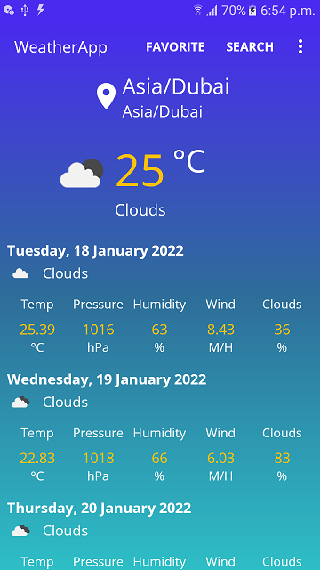
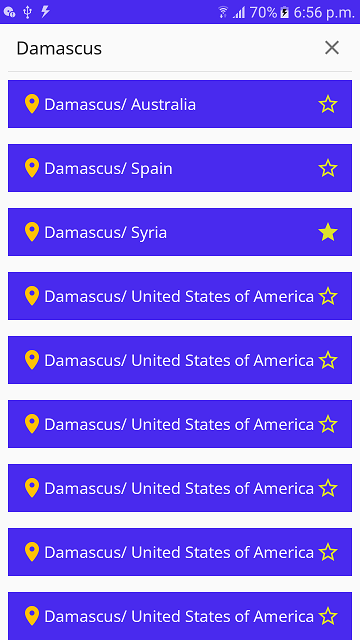
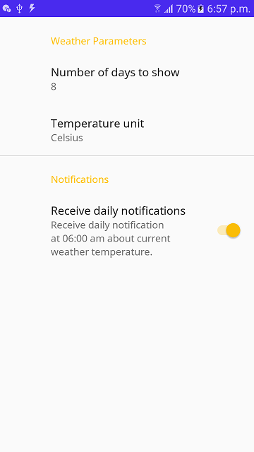

# WeatherApp
WeatherApp

What I have implemented.
========================

- Followed the MVVM with Repository architecture pattern.
	- Created WeatherActivity/WeatherViewModel, SearchCitiesActivity/SearchCitiesViewModel, FavoriteCitiesActivity/FavoriteCitiesVirwModel and MySettingsActivity which is a PreferenceScren.
	- Created two repositories, WeatherRepository which gets data from WeatherApi and CityRepository which gets data from CityApi and LocalDB).
  	- Created models to map the apis responses. I used OpenWeatherMap Api which returns WeatherReport model, and GeoDB api which returns CityResponse.
  	- Created a preference screen (MySettingsActivity) to control how many days to show in WeatherActivity, which temperature unit to show and if the user want to receive the daily notification or not, and save there values in SharedPreference to meet the user choices in UI.

- Used Room Database to save favorite cities.
- Used Dagger2 to implement dependency injection. I creaded AppComponent and MainComponent with various modules to provide a lot of objects to inject.
- Created two adapters, CitiesRecyclerAdapter to list the cities in the SearchCitiesActivity and FavoriteCitiesActivity, and DaysAdapter to list the weather days details in WeatherActivity).
- Created a brodcast receiver (AlarmReceiver) to receive a daily broadcast on 06:00 am to show a daily notification.
- Created many helper classes such as:
  - LocationFetcher: to fetch the current location of the device.
  - DateUtils: to convert timestamps to readable dates.
  - NotificationUtils: to show a notification.
  - AlarmUtils: to set the daily alarm or disable it.
  - Constants: to hold the app constants like APIs url and keys.
  
What I have NOT implemented.
========================
Due to the deadline, there are some ignored requirements.

- Caching Data: I had to get all of the app data (except for search) from the local DB and sync internally for updates.
- Unit tests: I had to use JavaUnitTest to test some units of the code.
- Multiple variants for different environments.
- Improvements in the UI and refreshing the data in a smooth way.

  
